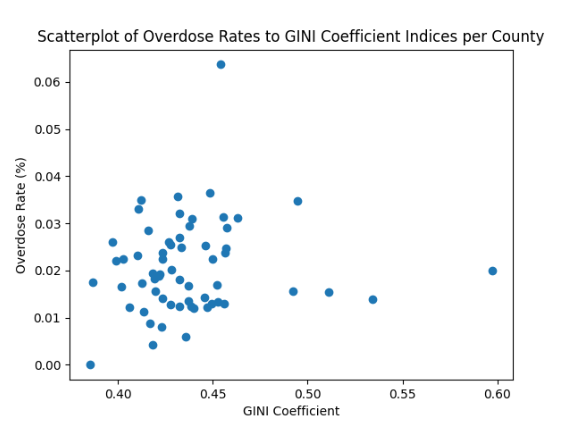

# NYS_Opioid_Epidemic
Maps and data analysis of the Opioid Epidemic in NYS as of data available December 2023. 
- Analysis done with Pandas, GeoPandas, and Folium

### Data Sources
- GINI Index data: https://apps.health.ny.gov/public/tabvis/PHIG_Public/opioid/reports/OP-CountyMostRecentYearData.xlsx 
- NYS Opioid Overdose Data: American Community Survey Data Table 2021, B19083, Gini Index Of Income Inequality. 
